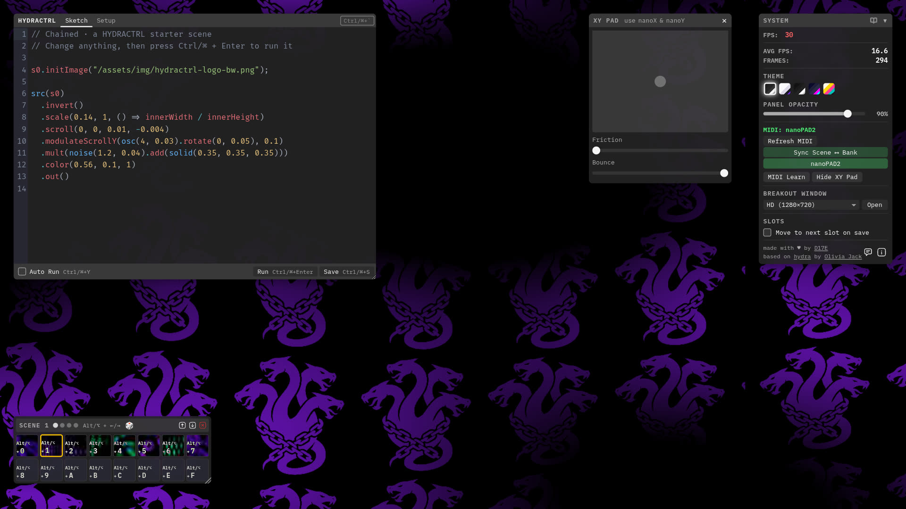

# HYDRACTRL

[](https://github.com/dxviie/HYDRACTRL/actions/workflows/ci.yml)
[](https://github.com/dxviie/HYDRACTRL/releases/latest)
[](./LICENSE)

A performance wrapper around [hydra](https://hydra.ojack.xyz/) for live visuals — for the moments where you don't necessarily want to be coding.

**[Open it in your browser](https://hydractrl.d17e.dev/app)** · **[Download the desktop app](https://hydractrl.d17e.dev/#download)** · [Website](https://hydractrl.d17e.dev/) · [Changelog](./CHANGELOG.md) · [Plugin docs](./docs/PLUGINS.md)

## Browser or desktop

HYDRACTRL comes in two flavours with the same interface, scenes and shortcuts:

| | Browser | Desktop app |
| --- | --- | --- |
| Where | [hydractrl.d17e.dev/app](https://hydractrl.d17e.dev/app), nothing to install | macOS 11+ (Apple Silicon or Intel) and Windows 10/11 (64-bit), [download](https://hydractrl.d17e.dev/#download) |
| Editor, 64 scenes, XY pad, docs, audio reactivity | Yes | Yes |
| MIDI (Korg nanoPAD2) | Chrome and Edge | Yes |
| Syphon (macOS) / Spout (Windows) output | No | Yes, 720p to 4K, 24 to 120 fps, optional alpha |
| Images and videos dropped on the editor | No | Yes, from a media folder |

The desktop app is an Electron shell around the same interface, with a live
Syphon or Spout feed of your visuals for Resolume, MadMapper, VDMX,
TouchDesigner, OBS and the like. See [desktop/README.md](./desktop/README.md)
for how it works and how to build it.

## Features

- **Scene management** — store and recall up to 64 scenes (4 banks × 16 slots) with thumbnail previews
- **MIDI integration** — built for the Korg nanoPAD2, including its XY pad with a small physics engine for expressive control (mouse works too)
- **Advanced code editor** — CodeMirror 6 with Hydra syntax highlighting, code completion, multiple themes and error reporting
- **Setup code tab** — code that runs before each sketch, for audio settings and globals
- **Audio reactivity** — Hydra's `a.fft` data out of the box, guarded by an audio watchdog that logs dropouts and auto-resumes suspended audio
- **Built-in Hydra documentation** — always at hand while coding
- **Breakout view** — send visuals to a second window at a precise size for projections or recordings ([OBS](https://obsproject.com/) and [NDI](https://ndi.video/) work great)
- **Desktop app with Syphon/Spout output** — share your visuals with Resolume, MadMapper, VDMX, TouchDesigner or OBS as a GPU texture, plus a chrome-less `/output` page for OBS and TouchDesigner browser sources (see below)
- **Import/export banks** — save and share entire scene banks as JSON
- **Share sketches as URLs** — `Alt/⌥ + U` copies a link with your sketch encoded in it
- **Plugin system** — new features are isolated plugins; write your own (see below)

## Keyboard Shortcuts

| Shortcut | Function |
| --- | --- |
| `Ctrl/⌘ + `` ` `` | Toggle UI visibility (works on any keyboard layout) |
| `Esc` | Bring back the hidden UI |
| `Ctrl/⌘ + Enter` | Run the current code |
| `Ctrl/⌘ + S` | Save code to the active slot |
| `Ctrl/⌘ + Y` | Toggle auto-run |
| `Alt/⌥ + U` | Copy the current sketch as a shareable URL |
| `Alt/⌥ + 0-9 / A-F` | Select slot 1-16 (HEX) in the current bank |
| `Alt/⌥ + ←/→` | Cycle between banks (when no MIDI device is connected) |
| `Alt/⌥ + X` | Export scene bank |
| `Alt/⌥ + I` | Import scene bank |

## Quick Start

### Requirements:

- [bun](https://bun.sh/)

```bash
# Install dependencies
bun install

# Start development server with hot reload
bun dev
```

Then open http://localhost:3000 in your browser. A local server opens straight
into the interface (at `/` and `/app`); the landing page of the hosted site is
at http://localhost:3000/index.html.

## The website

[hydractrl.d17e.dev](https://hydractrl.d17e.dev/) is a static
[Cloudflare Pages](https://pages.cloudflare.com/) site built from `public/`
with `bun run build:production`:

| Path | File | What |
| --- | --- | --- |
| `/` | `public/index.html` | The landing page; its scripts live in `src/site/` and its media in `public/site/` |
| `/app` | `public/app.html` | The interface |
| `/output` | `public/output.html` | The chrome-less render head |

The landing page plays a few hydra sketches in the background
(`src/site/sketches.js`), at reduced resolution and frame rate, paused for
people who prefer reduced motion. Links shared before the landing page
existed (`/#sketch=...`) are forwarded to `/app`.

## Building a Standalone Executable

Create a portable executable that includes all dependencies:

```bash
# Build executable with assets
bun run build:exe:full
```

This creates:
- `hydractrl.XXX` - The standalone executable. XXX depends on the OS you're building on, e.g. will produce an exe file on Windows.
- `hydractrl-public/` - Directory containing web assets (the website's landing page and its media are left out)

### Local File Support

In the desktop app you drop images and videos on the editor instead, see
[Images and videos](./desktop/README.md#images-and-videos).

When using the executable, you can serve local images and videos by placing them in a `local-assets/` directory before building. These files will be available at `http://localhost:3000/filename.ext` in your hydra sketches:

```javascript
// Example usage in hydra
await s0.initImage("http://localhost:3000/my-image.jpg");
await s0.initImage("http://localhost:3000/subfolder/nested-image.png");
await s0.initVideo("http://localhost:3000/my-video.mp4");
```

Supported formats:
- **Images**: `.jpg`, `.jpeg`, `.png`, `.gif`, `.webp`, `.svg`, `.ico`
- **Videos**: `.mp4`, `.webm`, `.ogg`, `.avi`, `.mov`

## Sharing Sketches as URLs

Press `Alt/⌥ + U` to copy a link with your current sketch encoded in the URL.
Opening such a link loads and runs the sketch without touching the recipient's
saved banks — nothing is persisted unless they explicitly save it. Links
copied in the desktop app or on a local server point at the browser version,
so anyone can open them.

## External Outputs (Syphon, Spout, OBS, TouchDesigner)

The quickest route to a Syphon or Spout source is the desktop app: one app
that runs the interface and shares the output. The pieces it builds on are
available to any setup:

The server exposes a chrome-less render head at
[http://localhost:3000/output](http://localhost:3000/output): one full-window
hydra instance, no panels. It follows the main UI live over a WebSocket: every
successful run and the XY-pad values (`nanoX`/`nanoY`) are mirrored to every
connected output, and an output that connects later gets the current sketch
straight away. Audio reactivity (`a.fft`) comes from the output's own
microphone input.

Anything that can render a web page can be an output:

- **HYDRACTRL Desktop** — the standalone app: the full interface
  plus a **Syphon** (macOS) or **Spout** (Windows) output of your visuals with
  zero GPU copies, controlled from the Output menu. See
  [desktop/README.md](./desktop/README.md).
- **OBS** — a Browser Source pointing at `/output`, then NDI, Spout or Syphon
  output plugins. Launch OBS with `--enable-media-stream` for microphone access.
- **TouchDesigner** — a Web Render TOP loading `/output`, then the NDI Out or
  Syphon Spout Out TOP.
- **A second browser window** on a projector, when a breakout window doesn't fit.

The page also runs a `#sketch=` share link on load, so it works on its own or
on a static host. The socket is open to anyone who can reach the server, like
the rest of the app, so keep it on a trusted network during shows.

## Plugins

New features are built as plugins on a small plugin system with an event bus,
quota-safe storage and error isolation — a broken plugin can't take down a live
set. Much of the app itself runs as built-in plugins (see
`src/client/plugins/`): URL sketch sharing, the audio watchdog, the info
panel, auto-run, slot advance on save, the breakout view, output sync, the
MIDI device UI and the mobile UI.

Want to implement your own? **[Read the plugin documentation](./docs/PLUGINS.md)** —
it covers the plugin shape, the context object you get, and the events you can
listen to. Plugins can even be registered at runtime from the browser console
via `window.hydractrl.registerPlugin(...)`.

## Development

```bash
bun run lint   # Biome checks (enforced in CI)
bun test       # unit tests (enforced in CI)
bun run build  # build the interface and landing page bundles
```

Contributions are welcome — bug reports and ideas live in
[GitHub issues](https://github.com/dxviie/HYDRACTRL/issues).

## Versions and releases

HYDRACTRL uses [semantic versioning](https://semver.org/), with one version
for the browser version and the desktop app; the About panel shows which one
you are running. Changes are listed in the [changelog](./CHANGELOG.md), and
[RELEASING.md](./RELEASING.md) describes how a release is cut: pushing a
`v1.2.3` tag builds the desktop app for macOS and Windows and publishes it on
the [releases page](https://github.com/dxviie/HYDRACTRL/releases), which the
website's download buttons point at.

## Credits & License

Built on top of [Hydra](https://hydra.ojack.xyz/) by [Olivia Jack](https://ojack.xyz/),
with [Bun](https://bun.sh/), [CodeMirror 6](https://codemirror.net/) and the Web MIDI API.
Made with ❤️ by [D17E](https://www.d17e.dev).

Licensed under the [GNU AGPL v3](./LICENSE).
