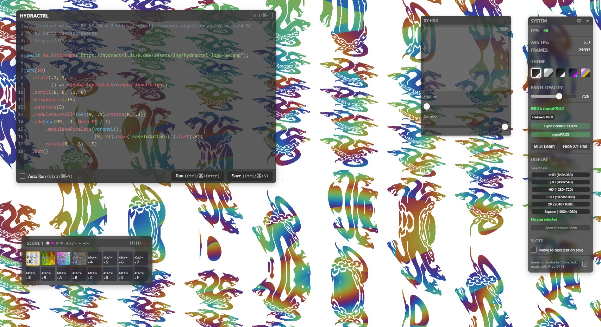

# HYDRACTRL

A wrapper around [hydra](https://hydra.ojack.xyz/) designed for live visual performances.
Check out the [project page](https://dxviie.github.io/HYDRACTRL/) or go [play around](https://hydractrl.d17e.dev)

## Quick Start

### Requirements:

- [bun](https://bun.sh/)

```bash
# Install dependencies
bun install

# Start development server with hot reload
bun dev
```

## Building Standalone Executable

Create a portable executable that includes all dependencies:

```bash
# Build executable with assets
bun run build:exe:full
```

This creates:
- `hydractrl.XXX` - The standalone executable. XXX depends on the OS you're building on, e.g. will produce an exe file on Windows.
- `hydractrl-public/` - Directory containing web assets

### Local File Support

When using the executable, you can serve local images and videos by placing them in a `local-assets/` directory before building. These files will be available at `http://localhost:3000/filename.ext` in your hydra sketches:

```javascript
// Example usage in hydra
await s0.initImage("http://localhost:3000/my-image.jpg");
await s0.initImage("http://localhost:3000/subfolder/nested-image.png");
await s0.initVideo("http://localhost:3000/my-video.mp4");
```

Supported formats:
- **Images**: `.jpg`, `.jpeg`, `.png`, `.svg`, `.ico`
- **Videos**: `.mp4`, `.webm`, `.ogg`, `.avi`, `.mov`